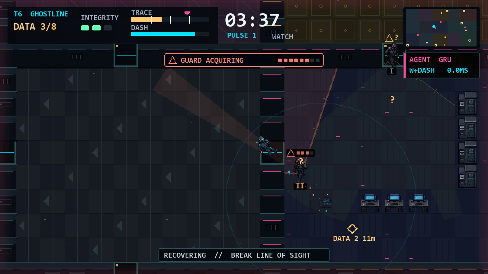
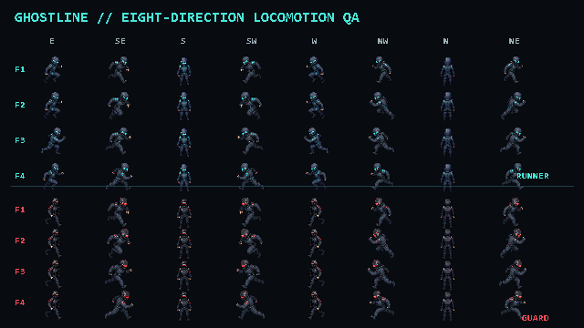
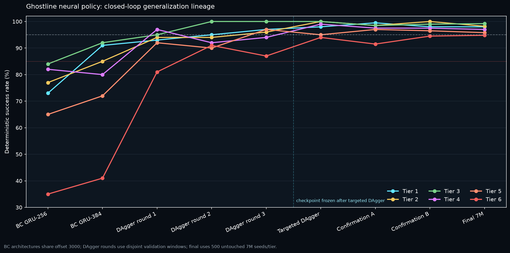
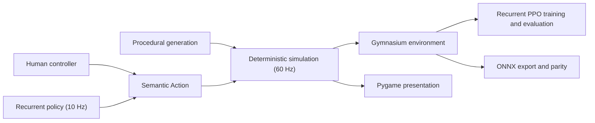

# Ghostline

Ghostline is a procedural 2D stealth-infiltration game and reinforcement-learning benchmark. Steal enough data to satisfy a contract, manage an escalating trace signature, and extract before security closes the route.

Keyboard, cursor, and touch play, Agent Lab, the recurrent policy, evaluation tools, and the replay recorder all use the same deterministic 60 Hz headless simulation and semantic action contract.

## Measured neural result

The current 384-unit GRU policy passed its one-time evaluation over 3,000
untouched 8M contracts after behavior cloning, four DAgger recovery rounds,
and low-rate consolidation. The result is bound to checkpoint
`76baa30a...b2e47` and environment fingerprint `521c449a...e129`.

| Tier | Target | Success | Wilson 95% | Mean damage | Median time |
|---|---:|---:|---:|---:|---:|
| 1 - Orientation | 95% | 499/500 (99.8%) | 98.88-99.96% | 0.000 | 12.98 s |
| 2 - Surveillance | 95% | 500/500 (100.0%) | 99.24-100.00% | 0.000 | 12.73 s |
| 3 - Patrol | 95% | 482/500 (96.4%) | 94.38-97.71% | 0.746 | 21.90 s |
| 4 - Countermeasure | 95% | 490/500 (98.0%) | 96.36-98.91% | 0.622 | 23.17 s |
| 5 - Lockdown | 95% | 495/500 (99.0%) | 97.68-99.57% | 0.560 | 27.86 s |
| 6 - Ghostline | 85% | 448/500 (89.6%) | 86.62-91.98% | 1.222 | 31.07 s |

[Watch the 39-second, native-720p tier-6 agent demo](videos/ghostline-demo.mp4). It records
the bundled champion on tier 6, seed `2,000,000`; desktop Agent Lab and the web
release expose an exact replay of that same contract. The full
[JSON](benchmarks/neural/champion-final-8m-500.json),
[aggregate CSV](benchmarks/neural/champion-final-8m-500.csv), and
[episode CSV](benchmarks/neural/champion-final-8m-500.episodes.csv) include
exact seeds, action hashes, reward accounting, failures, damage, detections,
trace, time, path efficiency, optional data, and inference latency.

## Gameplay



The world is authored on a 640×360 logical canvas and presented at 1280×720 or 1920×1080 with native-resolution text and UI; the recorded showcase now uses the same 1280×720 composition instead of enlarging a 360p capture. The world is never washed out by square exploration tiles: camera and guard sight appears as smooth 65-ray, occlusion-correct cones, with dashed electronic scans and notched human-sight boundaries. Facility transponders keep security actors readable after direct sight is broken, matching the same public entity state available to the policy. Suspicion becomes a segmented color-plus-shape meter before confirmed pursuit. Runner and guard locomotion retains all eight travel directions with dedicated four-frame diagonal cycles, while Standard, Interceptor, and Elite patrol badges make the tiered threat curve readable.



## Why it belongs in an RL portfolio

- Six procedural tiers with disjoint training, validation, and final-test seed namespaces.
- Shared tactical sensing: live facility-security telemetry shown to the human player is encoded in the same structured entity rows consumed by the policy.
- A universal entity-aware recurrent actor-critic with masked `Discrete(36)` actions and a fair observation-only teacher for BC/DAgger supervision.
- Deterministic replay, exact reward accounting, generation fuzzing, Wilson intervals, and ONNX parity testing.
- A complete playable game with menus, briefings, progression, accessibility settings, procedural audio, Agent Lab, and a packaged Windows build.





## Play

```powershell
py -3.13 -m venv .venv
.\.venv\Scripts\Activate.ps1
python -m pip install --constraint requirements.lock -e .
ghostline play
```

Python 3.13 is the release baseline (3.12-3.14 are supported). The base install
contains only the deterministic game/environment stack. Install
`.[agent]` to enable the selected ONNX policy in Agent Lab, or `.[dev]` for the
test and wheel-building toolchain:

```powershell
python -m pip install --constraint requirements.lock -e ".[agent]"
python -m pip install --constraint requirements.lock -e ".[dev]"
```

Controls:

- `WASD`: move
- `Shift`: energy-limited noisy dash
- `Space`: limited disruption pulse
- `Q`: acoustic decoy in the v2 research game
- `Left Ctrl`: crouch in the v2 research game
- `E`: use a vent or field-hack panel in the v2 research game
- `R`: retry the current seed
- `Esc`: pause or go back

Enter an amber terminal ring to link data. Movement inside the ring does not interrupt linking; leaving pauses progress and returning resumes it. After meeting quota, reach the green extraction relay.

### Multi-agent v2 research track

The released game, Agent Lab, and the published 89.6% tier-six runner are the
stable public `GhostlineEnv-v1` contract. Their immutable checkpoint, ONNX,
benchmark, and throughput records retain the historical internal
`GhostlineEnv-v2` label. That provenance is intentionally preserved rather than
rewriting signed evidence.

The new multi-agent game is the developmental `GhostlineEnv-v2` contract. It
can be selected from the main menu or launched directly:

```powershell
ghostline play --adaptive --tier 6 --directive ghost
```

The v2 game adds Standard, Ghost, Speed, and Greed directives; a limited
acoustic decoy; coordinated operative roles; discrete jam-aware radio; fair
temporary locks on graph-redundant doors; and telegraphed nonlethal suppressor
rounds on tiers 5-6. A shared security policy is used only when a compatible,
fingerprint-matched v2 checkpoint is supplied. Otherwise the game uses a
deterministic tactical fallback built from the same local observations and
action masks. The retired security checkpoint remains in the source archive as
historical evidence but is deliberately omitted from player wheels because it
is not valid for the rebuilt v2 environment. A new v2 campaign must finish
before the launcher can make a learned-security claim. None of this alters the
published v1 runner evidence above.

## Agent Lab and public environment

```powershell
ghostline lab --tier 6 --seed 2000000
```

```python
import gymnasium as gym
import ghostline

env = gym.make("GhostlineEnv-v1", tier=3, seed=42)
observation, info = env.reset(seed=42)
```

The v1 action space represents `9 movement × 2 dash × 2 pulse`
combinations. Observations contain ego state, an explicit player-equivalent
objective vector, an egocentric local grid, known targets, shared
live/last-seen/quantized-audio security intel, 24 directional rays, confidence
masks, and an action mask. The 13-feature entity record includes explicit guard
grade; no hidden live coordinate is exposed. Acquire objectives use stable
terminal hysteresis and a visible six-tile navigation look-ahead, so the HUD,
fair teacher, and neural policy receive the same non-oscillating route signal.

`GhostlineEnv-v1` is the published single-agent contract, not a deprecated
baseline. `GhostlineLegacyEnv-v0` is the compatibility-only predecessor.

`GhostlineEnv-v2` is a clean-break development contract. Its masked
`Discrete(288)` runner action represents
`9 movement x 2 dash x 2 pulse x 2 decoy x 2 crouch x 2 interact`.
The structured observation adds directive state, a 15-channel local grid,
public field status, up to 16 map-equivalent field targets, role-aware
perception-gated entity rows, and projectile danger rays. The context-sensitive
interact bit enters paired vents or operates a nearby camera, exact security
door, or room-light panel; the action mask disambiguates those mutually
exclusive uses.

The cooperative security environment is exposed by
`ghostline.security_env.parallel_env()` with metadata id
`GhostlineSecurityParallel-v2`. Operatives choose one of ten semantic intents,
one of ten public tactical targets, a radio message, and a role-gated ability.
Each actor receives local, perception-gated observations. A centralized,
permutation-aware, agent-specific critic sees the shared training state only
during learning; it is unavailable to deployed actors.

## Training and evaluation

Ghostline uses Python 3.13, Gymnasium 1.3, NumPy 2.5, and PyTorch 2.13
CUDA 13.0. Behavior cloning, DAgger, RND, recurrent PPO/GAE, checkpoint
selection, and resume state are implemented directly in PyTorch without an
additional RL framework dependency. Training dependencies are isolated from
both the base player and the lightweight ONNX agent runtime. The commands below
reproduce the published v1 lineage; their artifacts retain the historical
internal `GhostlineEnv-v2` metadata.

The developmental v2 runner has a separate fail-closed recurrent PPO entry
point:

```powershell
ghostline train-runner-v2 --output artifacts/runner-v2/preflight --published-v1-init models/ghostline-policy.pt --dry-run --cpu
ghostline train-runner-v2 --output artifacts/runner-v2/ppo --published-v1-init models/ghostline-policy.pt --envs 16 --rollout 512 --epochs 4 --gamma 0.999 --gae-lambda 0.98 --reward-scale 0.05 --seconds 86400
ghostline co-train-v2 --output artifacts/v2-cotraining --hours 48 --generations 3 --runner-learning-rate 0.00005 --runner-entropy-coefficient 0.003 --runner-initial-curriculum-tier 3 --runner-ghost-directive-fraction 0.25
# Recover an interrupted campaign after verifying its recorded configuration:
ghostline co-train-v2 --output artifacts/v2-cotraining --hours 48 --generations 3 --runner-learning-rate 0.00005 --runner-entropy-coefficient 0.003 --runner-initial-curriculum-tier 3 --runner-ghost-directive-fraction 0.25 --resume
```

The optional `--published-v1-init` path verifies the frozen checkpoint and
transplants only compatible weights; it does not treat the 36-action artifact
as a v2 policy or evidence. Co-training ranks every checkpoint on all six held-
out tiers even while adaptive curriculum limits the training distribution.
Completed league generations are hash-verified on resume, and only the first
incomplete generation is restarted from strict trainer checkpoints. See
[training](wiki/training.md) and
[setup](wiki/setup.md) for smoke/resume gates, curriculum, opponent scheduling,
and held-out selection.

The v2 preflight is complete: 10,000 generated facilities, runner and security
fresh/resume smokes, 1,000/1,000 v2 runner PyTorch/ONNX recurrent actions,
isolated wheel/source-archive checks, and exact reward ledgers all pass. The
measured 22-worker Windows CPU rate is 2,039 aggregate decisions/s, below the
aspirational 5,000 target, so the long campaign must calibrate worker count on
its actual host. These are readiness results, not a learned-v2 success claim.

```powershell
python -m pip install --constraint requirements.lock -e ".[train]"
ghostline train --hours 24 --experiment ghostline-universal
# One-shot release audit: run only after validation has selected and frozen the champion.
ghostline evaluate --model models/ghostline-policy.pt --episodes 500 --seed-start 8000000 --slice-manifest benchmarks/final-test-slices.json --output benchmarks/neural/champion-final-8m-500.json
ghostline export --model models/ghostline-policy.pt --output models/ghostline-policy.fp32.onnx --quantize --deployment-output models/ghostline-policy.onnx --parity-samples 1000
Copy-Item models/ghostline-policy.fp32.parity.json benchmarks/neural/champion-onnx-parity.json
python scripts/build_web.py --model models/ghostline-policy.onnx
```

Developmental v2 security training uses disjoint 10M training, 11M validation,
and a tracked one-way 14M final-test slice plus a separate fail-closed
checkpoint fingerprint. The retired security contract already consumed 12M
and 13M, so current-v2 starts from a new numeric window as well as a new
fingerprint:

```powershell
python -m pip install --constraint requirements.lock -e ".[marl]"
ghostline train-security --hours 72 --envs 8 --rollout 192 --epochs 2 --tiers 3,4,5,6 --runner-model models/ghostline-policy.pt --bc-warmup-steps 50000
ghostline train-security --init-model artifacts/security-bc/champion.pt --bc-warmup-steps 0 --no-resume --hours 72
ghostline evaluate-security --model artifacts/security-mappo/champion.pt --episodes-per-tier 500 --seed-start 14000000 --slice-manifest benchmarks/security/v2-final-test-slices.json
```

The CPU and CUDA paths are implemented. Training can mix the published v1
runner and native v2 runner snapshots through repeatable `--runner-pool`
arguments, or use `--scripted-runner` for the explicit easier baseline. The
runner trainer likewise accepts repeatable frozen `--security-opponent`
checkpoints. The security learner is a parameter-shared recurrent MAPPO policy:
decentralized actors consume only local player-equivalent information, while a
centralized permutation-aware critic predicts a separate value for each active
operative. Action masks cover all ten intents, including public-target PINCER
and SEAL orders. Active-agent masks prevent nonexistent or terminated
operatives from contributing policy, value, entropy, or GAE gradients.

Validation selects by worst-tier stop rate before aggregate metrics. Evaluation
writes JSON, aggregate CSV, and per-episode CSV with Wilson intervals and exact
reward-component accounting. The pre-migration security checkpoint and its
`4/0/8/16%` tier 3-6 result remain historical evidence only: the changed
observation, action, generation, reward, and critic fingerprints invalidate
that checkpoint for v2. No current v2 learned-security result is claimed until
a new held-out campaign completes. Lightweight player/web builds retain the
tactical fallback whenever a compatible checkpoint or PyTorch runtime is
unavailable.
The evidence protocol is documented in
[`benchmarks/security/README.md`](benchmarks/security/README.md).

Export always preserves the canonical FP32 graph. With `--quantize`, it also writes a dynamic-INT8 candidate and independently replays both recurrent graphs against PyTorch. `--deployment-output` receives INT8 only after zero deterministic-action mismatches; otherwise it receives the verified FP32 fallback. The sibling `.parity.json` audit records byte sizes, SHA-256 hashes, recurrent width, observation contract, transition count, per-artifact parity, size reduction, and the selected deployment precision.

See [Web and Vercel deployment](wiki/web-deployment.md) for the lazy ONNX agent bridge,
payload budgets, Chrome-only QA checklist, and static Vercel release flow.

Seed contracts:

- Training: `0–999,999`
- Validation: `1,000,000–1,049,999`
- Final test: `2,000,000+`. Every attempted slice is retired permanently. The 2M–7M reports are historical evidence; the current checkpoint consumed the locked 8M slice exactly once.

### Teacher benchmark history

Before the final route/security/patrol freeze, the fair observation-only teacher passed the then-untouched 6M gate over 500 seeds per tier:

| Tier | 1 | 2 | 3 | 4 | 5 | 6 |
|---|---:|---:|---:|---:|---:|---:|
| Success | 100.0% | 100.0% | 95.8% | 96.2% | 97.2% | 88.8% |

The complete tracked evidence, including Wilson intervals, damage, detections, duration, and path efficiency, is retained in [`benchmarks/teacher/teacher-release-gate-6m-500.json`](benchmarks/teacher/teacher-release-gate-6m-500.json) with a [CSV export](benchmarks/teacher/teacher-release-gate-6m-500.csv). It is explicitly a historical baseline, not the final frozen-distribution claim.

After live operative telemetry and the 95/97/99% chase-speed curve were frozen,
the current-fingerprint teacher passed two disjoint 100-seed-per-tier gates at
`100/100/99/99/99/86%` and `100/100/99/99/99/89%`. The selected neural
checkpoint then passed two independent validation windows before the one-time
8M audit reported above.

Neural acceptance requires at least 95% deterministic success on tiers 1-5 and
85% on tier 6 across 500 unseen seeds per tier. The frozen policy passed at
`99.8/100.0/96.4/98.0/99.0/89.6%`. The project makes no claim that this is
better than a real player: that comparison remains blocked on a matched-seed
human cohort of at least five unassisted participants. See
[the model card](models/model-card.md) for scope and limitations.

## Verification

```powershell
python -m pytest -q
python scripts/fuzz_ghostline_levels.py --seeds 10000
python scripts/fuzz_ghostline_levels.py --adaptive --seeds 10000
python scripts/benchmark_ghostline.py --decisions 10000 --tier 6 --workers 22 --minimum-decisions-per-second 3000 --output benchmarks/system/headless-throughput.json
python scripts/benchmark_ghostline.py --adaptive --decisions 1000 --tier 6 --workers 22 --minimum-decisions-per-second 0 --output artifacts/v2-readiness/headless-throughput.json
python scripts/verify_release_evidence.py
python -m build
python scripts/verify_source_archive.py
python scripts/verify_clean_install.py
# CI also installs dist/ghostline-*.tar.gz in a second isolated environment.
python -m pip install --constraint requirements.lock -e ".[build]"
ghostline package --model models/ghostline-policy.onnx
```

The portfolio Windows build requires the selected ONNX policy, embeds ONNX
Runtime and the model, and explicitly excludes PyTorch/training/media packages.
It also rejects stale/unlabelled graphs and requires the export report proving
at least 1,000 recurrent transitions with zero deterministic-action mismatches
for the exact packaged bytes and source-checkpoint SHA-256.
`ghostline package --human-only --dry-run` is available only for diagnostic
build inspection. CI also launches the packaged executable with a headless
simulation-and-policy smoke test before publishing the artifact.

`verify_release_evidence.py` is the read-only runner release authority. It independently
checks the 3,000 canonical final episodes and Wilson intervals, the consumed 8M
slice and all three output hashes, the exact checkpoint/ONNX/parity chain, the
tracked tier-6 throughput run, and `videos/ghostline-demo.mp4`. It cannot run or
reopen an evaluation. Ordinary pull requests run the complete tests, a
1,000-seed procedural diagnostic, clean-install checks, and a human-only web
build. A `v*` tag additionally requires the 10,000-seed audit and all frozen
neural evidence before building the Windows player and champion web bundle;
only then does the workflow create a GitHub Release containing both bundles,
the wheel, source archive, checkpoint, deployment ONNX, model card, final
JSON/CSV evidence, parity/throughput audits, and demo video. Manual workflow
dispatch performs the same gates and builds but never publishes a release.

`verify_security_release_evidence.py` verifies the immutable pre-migration 13M
records as explicitly historical evidence. Passing that audit does not qualify
them as `GhostlineSecurityParallel-v2` results. A separate current-v2 release
gate still requires a new compatible checkpoint, validation slices, one
untouched final slice, aggregate metrics, Wilson intervals, and CSV copies
frozen under the current fingerprints.

The original 5,000 decisions/s simulator target is not claimed by the current
live-telemetry build. The tracked WSL2 run reaches 3,194 aggregate decisions/s
(19,163 simulation ticks/s) across 22 workers and passes the explicit 3,000/s
release floor. This shortfall is retained as an optimization limitation.

The procedural validator checks connectivity, reachable quota and extraction,
safe spawn, unobstructed objectives, patrol validity, and security exclusion
zones. The v2 readiness audit additionally requires paired cross-room vents,
effectful and correctly bound field panels, non-overlapping interactions,
reachable field content, valid patrol routes, and graph-safe security doors.
Security cones are clipped to the same occlusion geometry used by simulation
detection. The generated static WebAssembly bundle is deployable from
`vercel.json`; interactive QA is performed in Chrome only. Portfolio web and
Vercel builds fail closed unless `models/ghostline-policy.onnx` exposes the
published v1 graph's verified historical `GhostlineEnv-v2` input metadata. The
browser manifest derives its recurrent width from that ONNX file. The web stage
contains only the explicit game-runtime module set and manifest-declared art,
includes version-locked BrowserFS/ONNX Runtime license notices, refuses
unmatched tier/seed result cards, and returns a failed live policy to
neutral-action human control.

## Repository map

- `src/ghostline/`: simulation, generation, game, environment, model, training, evaluation, export, and packaging.
- `src/neon_arena/`: preserved legacy prototype for engineering comparison.
- `tests/`: deterministic simulation, environment, presentation, model, CLI, and legacy regression tests.
- `benchmarks/teacher/`: tracked historical teacher gates, Wilson intervals, and immutable audit history.
- `benchmarks/neural/`: canonical final neural evaluation and ONNX parity evidence.
- `benchmarks/system/`: source-fingerprint-bound headless throughput evidence.
- `wiki/`: architecture, training, setup, assets, and design decisions.
- `models/`: selected checkpoint, ONNX policy, and model card.
- `videos/ghostline-demo.mp4`: selected portfolio gameplay/agent recording.

## Asset disclosure

Visual development used AI-assisted original drafts followed by manual palette, pixel, pivot, collision, animation, and in-game cleanup. Audio is synthesized procedurally at runtime. See [assets/licenses.json](assets/licenses.json) and [wiki/assets.md](wiki/assets.md).

## License

Ghostline source code and project-owned visual/audio assets are released under the [MIT License](LICENSE). AI-assisted asset provenance and cleanup are disclosed separately so portfolio viewers can distinguish generated drafts from manual engineering and integration work.

## Legacy baseline

The former Blackline Heist prototype is retained as historical evidence. Its
monolithic environment and old 84-value observation/checkpoint contract are
intentionally incompatible with the published `GhostlineEnv-v1`, the
developmental `GhostlineEnv-v2`, and the registered compatibility shim
`GhostlineLegacyEnv-v0`.
